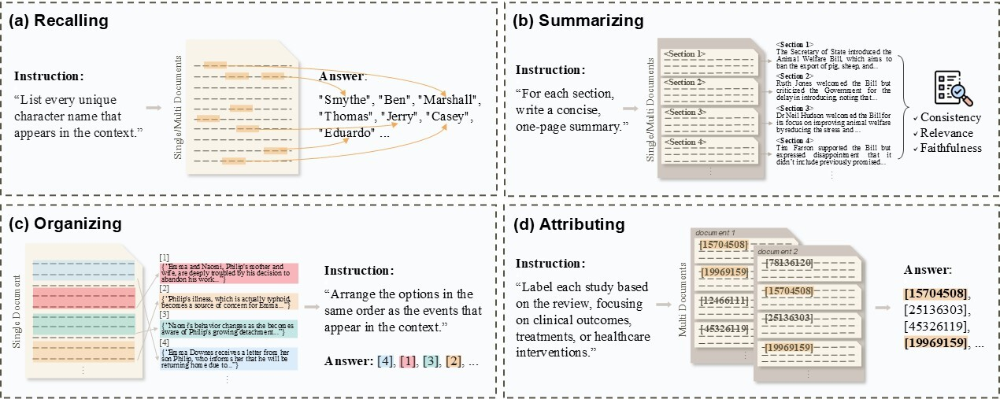

# ETHIC: Evaluating Large Language Models on Long-Context Tasks with High Information Coverage

<p align="center">
    📃 <a href="https://arxiv.org/abs/2410.16848" target="_blank">Paper</a> | 🤗 <a href="https://huggingface.co/datasets/dmis-lab/ETHIC" target="_blank">Dataset</a>
</p>

## 📋 Introduction
**ETHIC** is a long-context benchmark designed to assess whether LLMs can fully utilize the provided information. ETHIC comprises tasks with high **Information Coverage (IC)** scores (~91%), i.e. the proportion of input context necessary for answering queries.   



## ⚒️ Setup
We recommend using the following versions for compatibility.
* PyTorch 2.4.0
* Cuda 12.1
```shell
# create a new environment
conda create -n ethic python==3.9.19
conda activate ethic

# install required packages
pip install -r requirements.txt
```
## ⏩ Quickstart
To use our dataset directly, simply download it using 🤗 Datasets:

```python
from datasets import load_dataset

task = "Recalling" # Choose from "Recalling", "Summarizing", "Organizing", "Attributing"
dataset = load_dataset("dmis-lab/ETHIC", task)["test"]
```

For model inference and evaluation, prepare your OpenAI API key (or other keys for authorization) in _api_config.py_, as we utilize `gpt-4o` in the _Summarizing_ task.
```shell
# run.sh

CUDA_VISIBLE_DEVICES=1
export VLLM_WORKER_MULTIPROC_METHOD=spawn

task=Attributing # Recalling, Summarizing, Organizing, Attributing
model_name_or_path=meta-llama/Meta-Llama-3.1-8B-Instruct

# use_yarn=True
# under_32k_only=True
# over_32k_only=True
# domain=Medicine

cmd="CUDA_VISIBLE_DEVICES=$CUDA_VISIBLE_DEVICES python inference.py \
    --task $task \
    --model_name_or_path $model_name_or_path"

if [ "$use_yarn" = "True" ]; then
    cmd="$cmd --use_yarn"
fi
if [ "$under_32k_only" = "True" ]; then
    cmd="$cmd --under_32k_only"
fi
if [ "$over_32k_only" = "True" ]; then
    cmd="$cmd --over_32k_only"
fi
if [ -n "$domain" ]; then
    cmd="$cmd --domain $domain"
fi
if [ -n "$cache_dir" ]; then
    cmd="$cmd --cache_dir $cache_dir"
fi

eval $cmd
```

## Citation
```
@article{lee2024ethic,
  title={ETHIC: Evaluating Large Language Models on Long-Context Tasks with High Information Coverage},
  author={Lee, Taewhoo and Yoon, Chanwoong and Jang, Kyochul and Lee, Donghyeon and Song, Minju and Kim, Hyunjae and Kang, Jaewoo},
  journal={arXiv preprint arXiv:2410.16848},
  year={2024}
}
```
